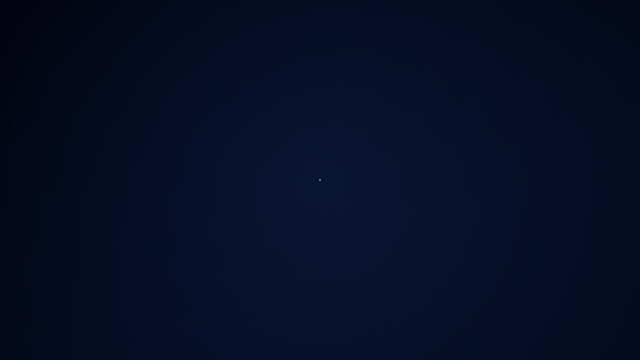
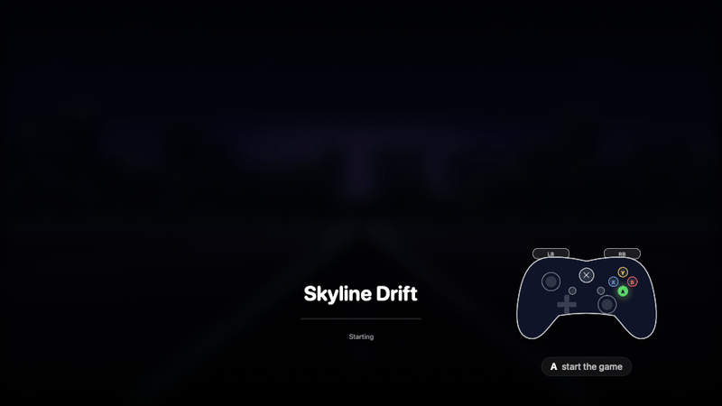
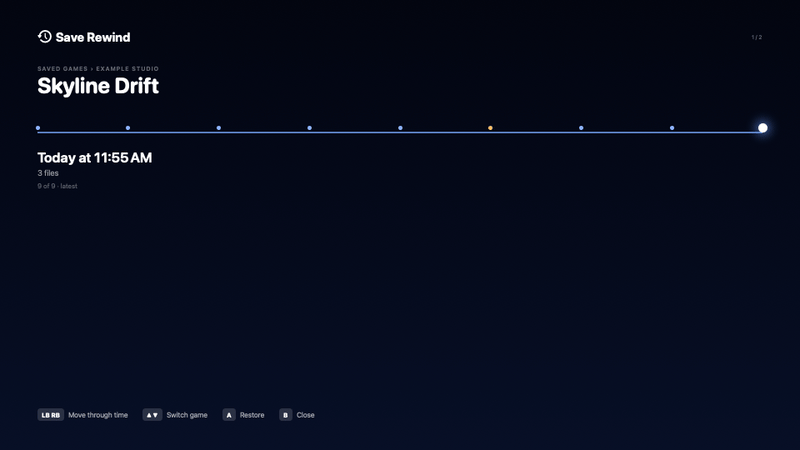
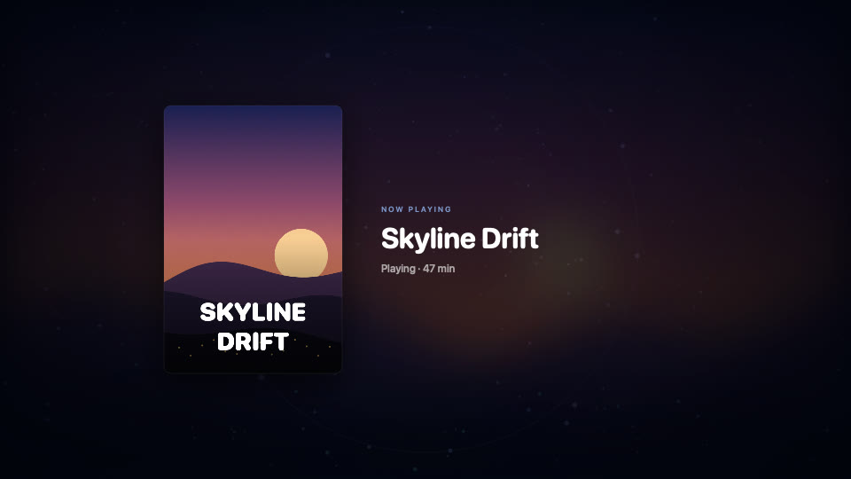
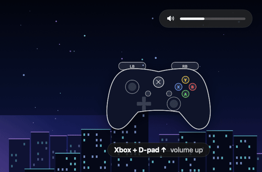
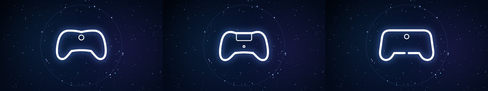
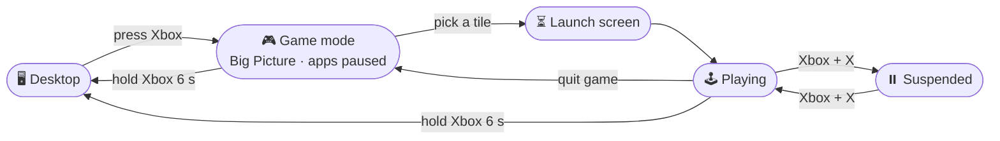

<div align="center">

# 🎮 Mac-mini-Frame · Console Mode

**Turn your Mac into a game console you run with a controller.**
Press the Xbox button and your Mac becomes a console. Hold it to get your desktop back.

[](https://github.com/CristoXD73/Pergolas/actions/workflows/ci.yml)




**[▶ Watch the 25-second tour (MP4)](docs/videos/console-mode-tour.mp4)** · [Install](#-install-in-one-line) · [Controls](#-controls) · [Add games](#-adding-windows-games) · [Performance tips](#-performance-tips)

</div>

---

## ✨ What it does

| | |
|---|---|
| 🕹️ **One button to play** | Press **Xbox**. Your apps are paused and hidden, and Steam Big Picture opens full screen, ready in about a second. |
| 🖥️ **Every screen joins in** | Extra displays show a slow starfield with your controller's outline, or a **Now Playing** card for the game you're in. The main screen stays yours. |
| 🍷 **Windows games as tiles** | Games in your CrossOver bottle appear in Big Picture with cover art. Launching one shows a loading screen and hands off smoothly: *"Scooting over to your game…"* |
| ⏸️ **Quick Resume** | Xbox + X suspends the game completely (0% CPU). Press again to continue exactly where you were. |
| ⏪ **Save Rewind** | Your saves are snapshotted while you play. Roll back to any point, and undo the rollback if you change your mind. |
| 🔊 **Glass HUD** | Volume, screenshots and the exit ring in Apple's frosted-glass style. Nothing sits on screen while you play. |
| 🛟 **Safe by design** | Paused apps always come back, even if Console Mode crashes: a watchdog wakes them. It never installs mid-game. |

<table>
<tr>
<td width="50%"><b>Hold Xbox to go back to your desktop</b><br></td>
<td width="50%"><b>Launching a Windows game</b><br></td>
</tr>
<tr>
<td><b>Save Rewind</b> (Xbox + LB)<br></td>
<td><b>Now Playing</b> on extra displays<br></td>
</tr>
<tr>
<td><b>Volume</b> (Xbox + D-pad)<br></td>
<td><b>Messages</b><br></td>
</tr>
</table>

It recognizes your controller and draws its outline:



<sub>The game shown here, "Skyline Drift", is made up. Every image and the video are rendered from the app's own views with <code>tools/render-media.sh</code>.</sub>

---

## 🚀 Install in one line

Open **Terminal** and paste:

```bash
curl -fsSL https://raw.githubusercontent.com/CristoXD73/Pergolas/claude/steam-console-macos-perf-4lbx1k/install.sh | zsh
```

That downloads the code to `~/Mac-mini-Frame`, builds it on your Mac, installs **Console Mode** in `/Applications` and starts it in the background. Run the same line again to update.

### What you need

- A Mac with **macOS 15 or newer** (Apple silicon recommended)
- **Apple's Command Line Tools**: the installer offers them if they're missing
- **[Steam for Mac](https://store.steampowered.com/about/)**, for Big Picture
- **[CrossOver](https://www.codeweavers.com/crossover)** with a bottle named **`Steam`**, if you want Windows games
- A controller: Xbox, PlayStation or Steam

### One-time setup (2 minutes, in System Settings)

| # | Where | Set | Why |
|---|---|---|---|
| 1 | **Game Controllers** › your controller › **Home button** | Open app → **Console Mode** | the Xbox button opens it |
| 2 | **Privacy & Security › Accessibility** | turn on **Console Mode** | instant (~1 s) start |
| 3 | **Privacy & Security › Screen & System Audio Recording** | turn on **Console Mode** | screenshots |
| 4 | **General › Login Items** | remove **Steam** | Console Mode starts Steam quietly itself |

That's it. **Press the Xbox button.**

---

## 🎮 Controls

| Press | What happens |
|---|---|
| **Xbox** | Game mode: Big Picture opens, apps are paused, extra screens are taken over |
| **Hold Xbox 6 s** | Back to your desktop. A ring appears after 2 s so you know it's working |
| **Xbox + D-pad ↑ / ↓** | Volume up / down (hold to repeat) |
| **Xbox + Y** | CPU / GPU / memory / storage overlay |
| **Xbox + View** | Screenshot → `~/Pictures/Console Mode` |
| **Xbox + X** | Quick Resume: suspend or resume the game |
| **Xbox + Menu + View** (twice) | Force quit a stuck game |
| **Xbox + LB** | Save Rewind: roll the game's saves back in time |



---

## 🍷 Adding Windows games

**Games installed through the bottle's Steam** appear as tiles automatically, with cover art. Nothing to do.

**Any other Windows game you own:** quit Mac Steam, then:

```bash
"/Applications/Console Mode.app/Contents/Resources/add-game" "Game Name" exe "/path/to/Game.exe"
```

It shows up in Big Picture › Library › **Non-Steam**. Other useful commands:

| Command | Does |
|---|---|
| `add-game --list` | show your tiles and which CrossOver runs each |
| `add-game --engine "Game Name" stock` | run a game on the stock CrossOver (D3DMetal 3), or `gptk4` for the GPTK 4 build |
| `add-game --remove "Game Name"` | remove a tile |
| `add-game --sync` | re-scan the bottle's Steam games |

---

## ⚡ Performance tips

Measured on a Mac mini, with CrossOver and Game Porting Toolkit 4:

- **In the game, choose DLSS** (Performance or Balanced), **not XeSS or FSR.** CrossOver turns DLSS into Apple's own **MetalFX** upscaler. *Clair Obscur: Expedition 33* had the GPU pinned at **100%** with XeSS, even on Low. Switching the upscaler dropped it to **~69%** within a second.
- **Bottle settings:** D3DMetal graphics, **MSync** on, **DLSS** on. These match Andrew Tsai's and CodeWeavers' guides.
- **Frame generation:** leave it off if you see tearing.
- **Games on an external drive** load slower (USB hard drives: ~2 ms per random read vs ~0.2 ms internal) but play the same once loaded.

---

## ❓ Troubleshooting

<details>
<summary><b>The Xbox button doesn't open Console Mode</b></summary>

Check step 1 of the setup: System Settings › Game Controllers › your controller › Home button → **Console Mode**. Console Mode also listens for the controller itself while it waits in the background.
</details>

<details>
<summary><b>It takes ~5 seconds to start instead of ~1</b></summary>

Turn on **Accessibility** for Console Mode (setup step 2). Without it, Big Picture has to be opened from scratch each time.
</details>

<details>
<summary><b>My apps are still paused after something went wrong</b></summary>

The watchdog resumes them automatically within 15 seconds. You can also run `~/Mac-mini-Frame/uninstall.sh`, which always resumes everything first.
</details>

<details>
<summary><b>A game runs slowly</b></summary>

See [Performance tips](#-performance-tips). The upscaler setting inside the game matters most. Logs are in `~/Library/Logs/ConsoleMode.log`.
</details>

---

## 🧹 Uninstall

```bash
curl -fsSL https://raw.githubusercontent.com/CristoXD73/Pergolas/claude/steam-console-macos-perf-4lbx1k/uninstall.sh | zsh
```

- **Removes:** the app, its background helpers, and only the Steam tiles it added.
- **Keeps:** your games, your bottle, your own shortcuts and your save backups.

Add `-s -- --purge` to the line above to also delete internal-drive backups, settings and logs.

---

## ⚙️ Settings (optional)

`~/Library/Application Support/Console Mode/config.json`:

```json
{
  "gamesDrive": "/Volumes/Games",
  "backupDest": "/Volumes/Backup/Console Mode/Save Backups",
  "keepSteamLoaded": true,
  "nowPlaying": true,
  "gamingAudioOutput": "LG TV",
  "lowStorageGB": 50
}
```

| Key | Meaning |
|---|---|
| `gamesDrive` | where your Windows games live |
| `backupDest` | where Save Rewind keeps snapshots |
| `keepSteamLoaded` | keep Steam warm in the background for ~1 s starts |
| `nowPlaying` | show the Now Playing card on extra displays |
| `gamingAudioOutput` | switch sound to this device in game mode |
| `lowStorageGB` | warn when a drive has less free space than this |

---

## 🛠️ For developers

```bash
./build.sh               # build and install to /Applications
./build.sh --no-install  # build only
zsh tests/test_scripts.sh
./tools/render-media.sh  # regenerate the README images and video (needs ffmpeg)
```

- [`docs/HANDOFF.md`](docs/HANDOFF.md): design, every hard-won finding, setup and test status
- [`docs/AI-HANDOFF.md`](docs/AI-HANDOFF.md): current state, for the next developer or AI
